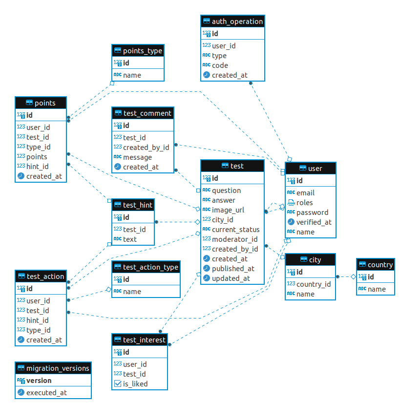

# City expert backend

### About
Backend for web app.

Web app presents quiz, where users guess city objects on photo.
- Register or login.
- Choose liked test and try to guess it.
- Score points for right answers.
- Upload your own tests and after moderation users can answer and estimate it.

### Tech details
- Backend on PHP ([Symfony](https://symfony.com/))
- DB [Postgresql](https://www.postgresql.org/)
- Webserver and cache proxy [Nginx](https://nginx.org/en/)
- Queue on [Redis](https://redis.io/)
- Storage [Minio](https://min.io/)
- Image resizer [imgproxy](https://imgproxy.net/)
- [Frontend](https://github.com/log95/city-expert-frontend) on Vue
- [WebSocket server](https://github.com/log95/city-expert-websocket-server) on Ratchet
- Auth via JWT [LexikJWT](https://github.com/lexik/LexikJWTAuthenticationBundle)
- Moderation based on finite state machine ([Symfony Workflow](https://symfony.com/doc/current/components/workflow.html))
- Tests on [Codeception](https://codeception.com/)

DB diagram 

  
 
### Start app
- Need `docker`, `docker-compose` installed
- Clone repository. `git clone https://github.com/log95/city-expert-backend.git`
- Up environment. `./local-env.sh up`
- Up [frontend](https://github.com/log95/city-expert-frontend) and [WS server](https://github.com/log95/city-expert-websocket-server) if needed
- If need email sending, then set `MAILER_DSN` in `.env` to [Mailtrap](https://mailtrap.io/) for example.
